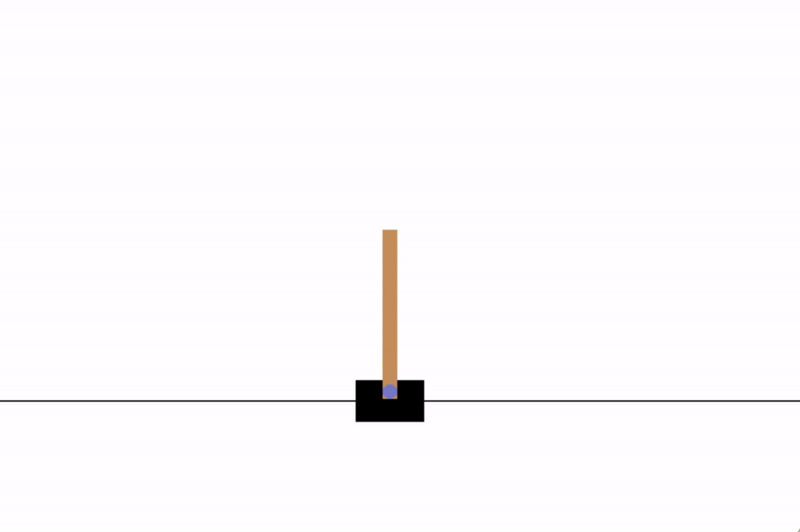
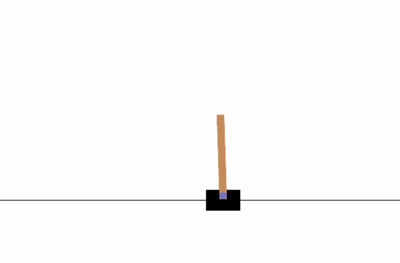
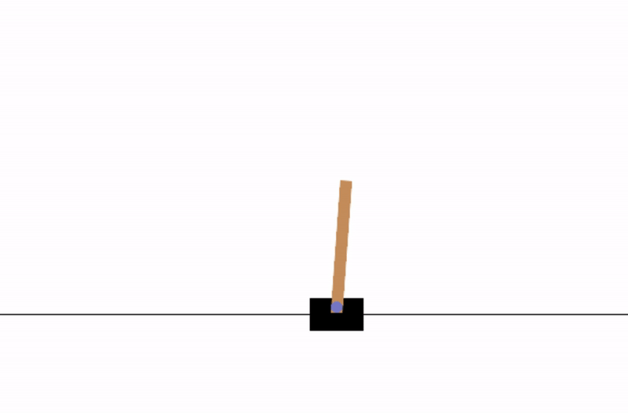

# Comparative Analysis & Implementation of Foundational Deep Reinforcement Learning Algorithms 

This research project examines three Deep Reinforcement Learning (DRL) algorithms: Deep Q-Networks (DQN), REINFORCE, and Actor-Critic (A2C). DQN is good for high-dimensional spaces but struggles with continuous actions and overestimates Q-values. REINFORCE is effective in high-dimensional action spaces but faces issues with variance and sample efficiency. A2C, combining value and policy methods, offers stability but is complex. The project aims to develop these algorithms from scratch using PyTorch, following original methodologies, and evaluate their performance using OpenAI's Gymnasium -- CartPole & Ms PacMan.

## Environment
I use two environments to test the performance separately, such as [CartPole](https://gymnasium.farama.org/environments/classic_control/cart_pole/)) and [Ms PacMan](https://gymnasium.farama.org/environments/atari/ms_pacman/).

| CartPole | Ms PacMan|
| :--------: | :--------: |
|| |

## Training Results

| CartPole - Policy Gradient | CartPole - DQN |
| :--------: | :--------: |
|| |

| CartPole - DQN  | CartPole - REINFORCE | CartPole - A2C |
| :--------: | :--------: | :--------: |
| | | |

| Ms PacMan - DQN |
| :--------: |
| |
